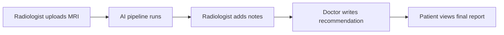

# NeuroScan Nepal — Viva Demo Script

**Duration:** ~10 minutes  
**Presenter:** Pragya Gajurel (23189634)  
**Project:** AI-assisted brain MRI screening for Nepal (BCU final year)

---

## Before you start (5 minutes before viva)

1. **Start the app** — double-click `START_NEUROSCAN.bat` in the project folder.
2. Wait until two PowerShell windows stay open (backend + frontend).
3. Confirm the browser opens to **http://127.0.0.1:3000/login**.
4. Confirm backend health: **http://127.0.0.1:8000/health** should return `"status": "ok"`.
5. Have one sample MRI ready (from `data/raw/normal/` or `data/raw/abnormal/`).
6. Optional: open the **backend terminal** on a second screen so examiners can see pipeline logs.

### Demo accounts

| Role | Name | Email | Password |
|------|------|-------|----------|
| Radiologist | Kishor Phuyal | radiologist@neuroscan.np | radiologist123 |
| Doctor | Dr. Bikram Prasad Gajurel | doctor@neuroscan.np | doctor123 |
| Patient | Ram Bahadur Thapa | patient@neuroscan.np | patient123 |

Patient unique ID (auto-assigned): **NSN-PAT-000001**

---

## Demo flow overview

---

## Part 1 — Radiologist (4 minutes)

### 1.1 Login

- Go to **http://127.0.0.1:3000/login**
- Email: `radiologist@neuroscan.np` / Password: `radiologist123`
- **Say:** *"Radiologists are the only role that can upload scans and trigger the AI pipeline."*

**Screenshot:** Login page with radiologist credentials filled in.

### 1.2 Dashboard

- You land on the **Home** dashboard showing job statistics.
- **Say:** *"This is the clinical AI dashboard — it tracks all scans processed through the system."*

**Screenshot:** Home dashboard with stat cards.

### 1.3 Upload MRI

- Click **Upload MRI scan** (or go to `/upload`).
- Select patient **Ram Bahadur Thapa (NSN-PAT-000001)** from the dropdown.
- Choose one MRI image from the dataset.
- Click **Upload & analyse**.
- **Say:** *"Each scan is linked to a unique patient ID for traceability — important for RBAC and audit."*

**Screenshot:** Upload page with patient selected and file chosen.

### 1.4 Live processing

- You are redirected to **Processing** — watch the 8 pipeline stages complete:
  1. Upload  
  2. Preprocessing (CLAHE + QC)  
  3. CNN Detection  
  4. Grad-CAM Explainability  
  5. RAG Medical Advisory  
  6. Bilingual Chatbot  
  7. Hospital Finder  
  8. Report Generation  
- **Say:** *"The backend logs each stage step-by-step. CLAHE improves contrast; low-quality scans are flagged before classification."*

**Screenshot:** Processing page with stages (ideally mid-run and completed).

### 1.5 Results & explainability

- Open **Results** for the completed job.
- Point out:
  - **Classification** (Normal / Abnormal)
  - **Confidence score** (calibrated; review flag if below 70%)
  - **Grad-CAM heatmap** — regions influencing the decision
  - **RAG advisory** and hospital finder output
- **Say:** *"Grad-CAM provides explainability — the model doesn't just give a label, it shows where it looked."*

**Screenshot:** Results page showing label, confidence, and Grad-CAM overlay.

### 1.6 Radiologist investigation notes

- Scroll to **Investigation recommendation** on the Results page.
- Enter a short note, e.g.: *"Recommend follow-up MRI with contrast in 3 months. No immediate intervention required."*
- Click **Save notes**.
- **Say:** *"The radiologist's notes are visible to the doctor and patient — this closes the loop between AI output and human review."*

**Screenshot:** Radiologist notes section filled in.

### 1.7 Model information (optional, 30 sec)

- Go to **Model** in the nav.
- **Say:** *"Our CNN baseline achieves 97.81% validation accuracy and 98.12% balanced accuracy on 1,600 Grande International Hospital scans."*

**Screenshot:** Model Info page showing 97.81% validation accuracy.

---

## Part 2 — Doctor (2 minutes)

### 2.1 Logout and login as doctor

- Log out (header menu).
- Login: `doctor@neuroscan.np` / `doctor123`
- **Say:** *"Doctors cannot upload scans — they review AI results and write clinical recommendations."*

**Screenshot:** Login as doctor.

### 2.2 Doctor review

- Go to **Doctor Review** (`/doctor-review`).
- Select the scan you just uploaded.
- Review AI classification, confidence, and radiologist notes.
- Enter **Clinical recommendation**, e.g.: *"Agree with AI finding. Schedule outpatient neurology follow-up. Patient counselled on symptoms to watch."*
- Optional: add **Clinical notes**.
- Click **Submit review**.
- **Say:** *"The doctor's recommendation is the authoritative clinical sign-off — the AI assists, it does not replace the clinician."*

**Screenshot:** Doctor review form with recommendation submitted.

---

## Part 3 — Patient (2 minutes)

### 3.1 Login as patient

- Log out and login: `patient@neuroscan.np` / `patient123`
- **Say:** *"Patients see only their own records — enforced by role-based access control on every API endpoint."*

**Screenshot:** Patient login.

### 3.2 My records

- Go to **My Records** (`/my-records`).
- Show:
  - Patient unique ID (**NSN-PAT-000001**)
  - Scan result (label + confidence)
  - Radiologist investigation notes
  - Doctor's recommendation
- **Say:** *"The patient portal gives transparent access to their screening report without exposing other patients' data."*

**Screenshot:** Patient portal with full report visible.

---

## Part 4 — Technical talking points (1–2 minutes)

Use these if examiners ask technical questions:

| Topic | Key point |
|-------|-----------|
| **Dataset** | ~1,600 anonymised brain MRI scans from Grande International Hospital |
| **Model** | 3-block CNN, 128×128 grayscale, binary classification |
| **Accuracy** | 97.81% validation, 98.12% balanced (see `results/cnn_baseline_report.txt`) |
| **Preprocessing** | CLAHE contrast enhancement, quality gate for low-contrast images |
| **Explainability** | Grad-CAM heatmaps on CNN feature maps |
| **Security** | JWT auth, bcrypt passwords, SQLite user store, role checks on all routes |
| **Stack** | React + Vite frontend, FastAPI backend, PyTorch inference |
| **Limitation** | Research prototype — not validated for clinical deployment |

---

## Screenshot checklist (for dissertation / report)

Capture these during rehearsal and save to a `screenshots/` folder:

- [ ] Login page (all three roles — one screenshot each or a composite)
- [ ] Radiologist home dashboard
- [ ] Upload page with patient dropdown
- [ ] Processing page — stages in progress
- [ ] Processing page — all stages complete
- [ ] Results — classification + confidence
- [ ] Results — Grad-CAM heatmap
- [ ] Results — radiologist notes saved
- [ ] Model Info page (97.81% accuracy)
- [ ] Doctor review — form filled
- [ ] Doctor review — after submit
- [ ] Patient portal — my records with doctor recommendation
- [ ] Backend terminal — pipeline log output (optional)

**Tip:** Use Windows **Win + Shift + S** for quick region captures. Name files clearly, e.g. `01_login_radiologist.png`.

---

## Rehearsal checklist

Run through this at least **twice** before the viva:

- [ ] `START_NEUROSCAN.bat` starts both servers without errors
- [ ] Login works for all three demo accounts
- [ ] Upload completes and pipeline finishes within ~30–60 seconds
- [ ] Confidence shows a realistic percentage (not 0%)
- [ ] Grad-CAM image renders on Results page
- [ ] Radiologist notes save successfully
- [ ] Doctor can see the scan and submit review
- [ ] Patient sees the doctor recommendation
- [ ] You can explain RBAC in one sentence per role
- [ ] You can quote model accuracy from memory: **97.81%**

---

## Troubleshooting during demo

| Problem | Fix |
|---------|-----|
| "Backend is offline" banner | Check backend PowerShell window; restart with `START_NEUROSCAN.bat` |
| Login returns 401 | Delete `neuroscan.db` and restart backend to re-seed demo users |
| Upload fails | Confirm you are logged in as **radiologist** and selected a patient |
| Confidence shows 0% | Refresh page; ensure latest frontend code is running |
| Pipeline stuck | Check backend terminal for errors; verify `models/cnn_baseline.pth` exists |
| Port already in use | Close old PowerShell windows, or change port in start script |

---

## Closing statement (30 seconds)

*"NeuroScan Nepal demonstrates an end-to-end AI-assisted MRI screening workflow tailored for Nepal — from radiologist upload through doctor sign-off to patient access. The system combines a 97.81%-accurate CNN, explainable Grad-CAM visualisations, and role-based access control. It is a research prototype designed to show feasibility, not to replace qualified clinicians."*

---

## Quick reference URLs

| Page | URL |
|------|-----|
| Login | http://127.0.0.1:3000/login |
| Upload | http://127.0.0.1:3000/upload |
| Doctor review | http://127.0.0.1:3000/doctor-review |
| Patient records | http://127.0.0.1:3000/my-records |
| Model info | http://127.0.0.1:3000/model |
| Backend health | http://127.0.0.1:8000/health |
